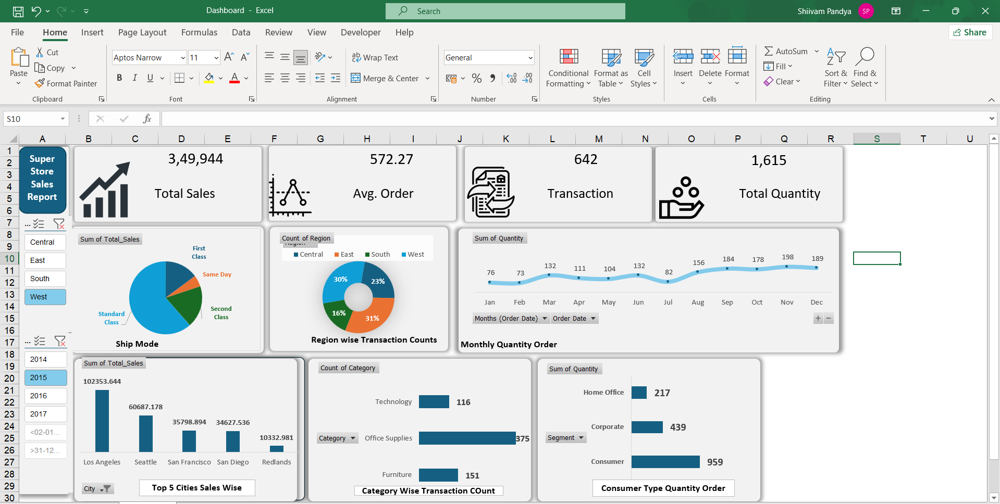

# Excel Sales & Operations Analysis Dashboard

This project is an interactive Excel dashboard created using the Superstore dataset to analyze sales and operational performance.

The dashboard transforms raw sales data into an interactive business report using Pivot Tables, Pivot Charts, Slicers, and Power Query.

## Project Objective

The objective of this project is to analyze sales performance, order activity, customer segments, regions, product categories, and monthly trends using Microsoft Excel.

## Key KPIs

- Total Sales: 349,943.91
- Total Quantity: 1,615
- Total Orders: 642
- Average Order Value: 572.27

## Analysis Covered

- Sales performance by region
- Sales by product category
- Customer segment analysis
- Monthly sales trends
- Order volume analysis
- Quantity analysis
- Regional performance comparison
- Category and segment performance
- Shipping class analysis

## Dashboard Features

- Interactive slicers
- KPI cards
- Pivot Tables
- Pivot Charts
- Monthly trend analysis
- Region-wise analysis
- Category-wise analysis
- Segment-wise analysis
- Shipping class analysis
- Interactive business reporting

## Dashboard Preview

## Tools & Technologies

- Microsoft Excel
- Pivot Tables
- Pivot Charts
- Power Query
- Slicers
- Data Cleaning
- Data Transformation
- Data Visualization
- Business Reporting

## Files Included

### Sales_Operations_Dashboard.xlsx

Interactive Excel dashboard containing the analysis and visualizations.

### Superstore_Sales_Data.xlsx

Source dataset used for the analysis.

### Sales_Operations_Dashboard.png

Dashboard preview screenshot.

## Business Value

The dashboard converts raw sales data into an interactive reporting tool that can be used to monitor sales performance, compare regions and categories, identify monthly trends, and understand customer segment performance.

## Skills Demonstrated

- Data Cleaning
- Data Transformation
- Excel Dashboard Development
- Pivot Table Analysis
- Pivot Chart Development
- Data Visualization
- KPI Reporting
- Trend Analysis
- Business Analysis
- Interactive Reporting
